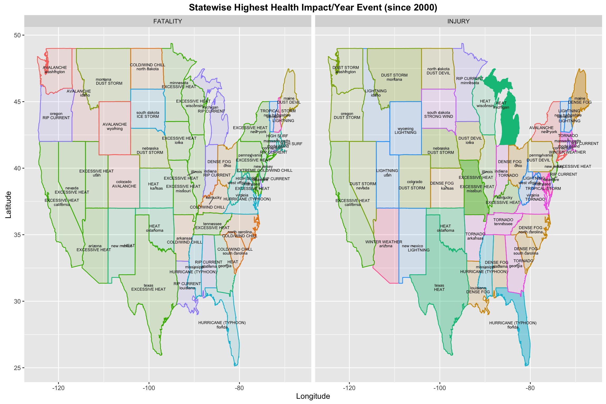
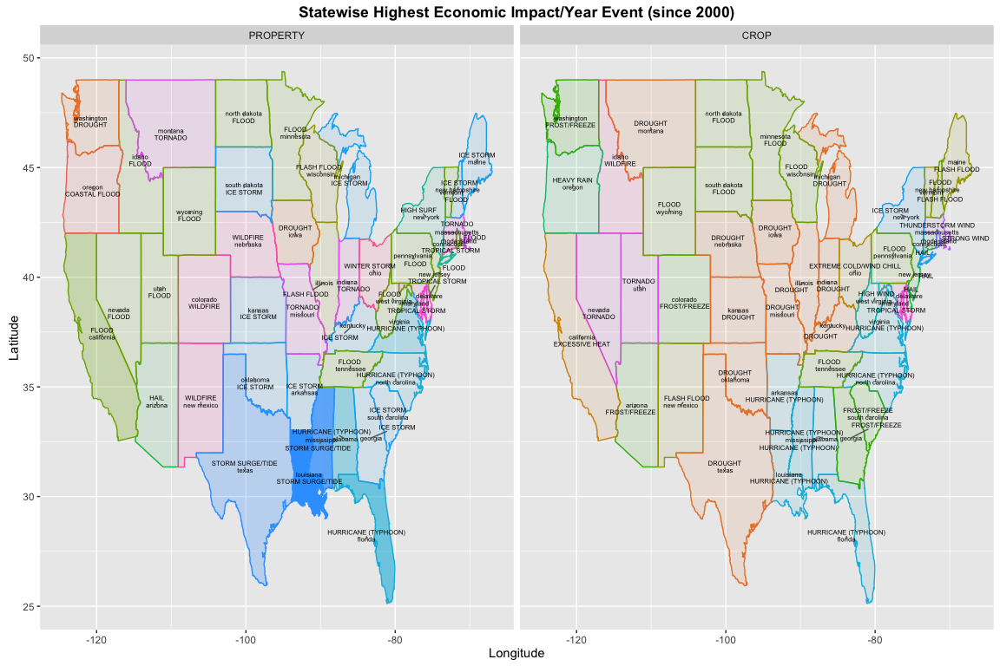
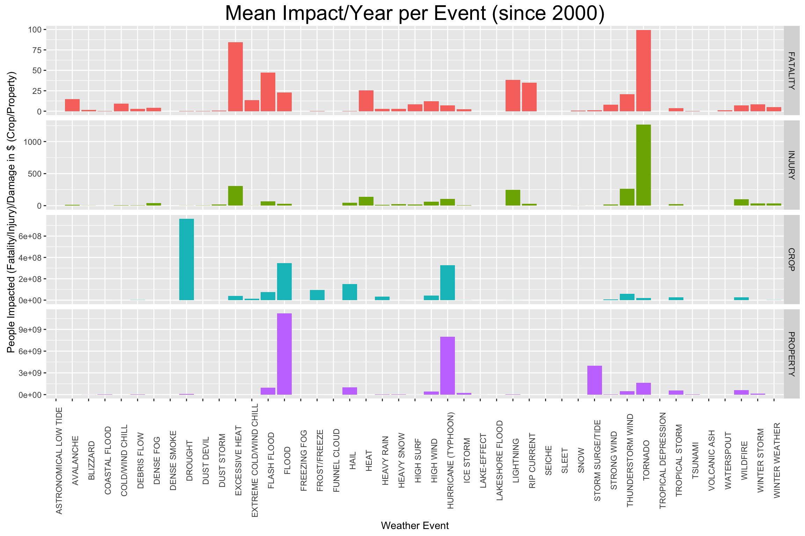

# Analysis of NOAA Storm Data shows that different events are responsible for fatalities, injuries, crop and property damage in each US state
Arnab Nandi  
28 July 2016  
## Synopsis
The summary analysis of the [NOAA Storm Database](https://d396qusza40orc.cloudfront.net/repdata%2Fdata%2FStormData.csv.bz2) finds the following points: -

* Tornado causes the highest loss to human life and the highest injury per year.
* Drought causes the most crop damage in dollar terms per year, whereas flooding causes the most property damage.
* Across each state, the event that causes the most fatalities vary, for example, the southern states are prone to fatalities related to excessive heat (Texas/California/Arizona), the northern states are prone to fatalities related to avalanches (Washington/Idaho/Wyoming/etc.)
* Across each state, the event that causes the most injuries vary, for example, Texas has highest heat related mean injury per year states, whereas, the north-western states like Montana/North Dakota/Washington/etc. are prone to injuries related to dust storms.
* Across each state, the event that causes the most property damage vary, for example, Louisiana storm surge/tide related property damage per year is highest, whereas, in Nebraska/Colorado and other central states, wildfire causes the most property damage.
* Crop damage causes also vary, for example, northern states like North and South Dakota, Minnesota and Wisconsin see highest flood related crop damage, whereas, California sees heat related crop damage.

## Data Processing
This section downloads the data from the [NOAA Storm Database](https://d396qusza40orc.cloudfront.net/repdata%2Fdata%2FStormData.csv.bz2) and loads it into an R data.table. One of the issues we see with the NOAA Database is the quality of the data is not as good as could be. As an example of this, the NOAA guidelines for capturing storm data, [Page 5-6 of this document](https://d396qusza40orc.cloudfront.net/repdata%2Fpeer2_doc%2Fpd01016005curr.pdf), says that events can only be one of the ones in the Storm Data Event Table. However, we see from the available data, that much of this data is captured with event type not in the Storm Data Event table.


```r
library(dplyr)
library(data.table)
library(ggplot2)
library(reshape2)
library(maps)
library(ggrepel)

# Load the data directly from the URL provided
download.file(url = "https://d396qusza40orc.cloudfront.net/repdata%2Fdata%2FStormData.csv.bz2", 
              destfile = "Storm_Data.bz2",
              method = "libcurl")
# 
df <- read.csv("Storm_Data.bz2", stringsAsFactors = F)

# Convert the frame to a data.table as we are going to make heavy use of it
dt <- data.table(df)

# To reduce quality issues, capitalise all event types
dt[, EVTYPE := toupper(EVTYPE)]

# According to the Storm Data Event Table in the NOAA document (https://d396qusza40orc.cloudfront.net/repdata%2Fpeer2_doc%2Fpd01016005curr.pdf), we create a permitted events character vector

permittedevents <- c("ASTRONOMICAL LOW TIDE",
                     "AVALANCHE",
                     "BLIZZARD",
                     "COASTAL FLOOD",
                     "COLD/WIND CHILL",
                     "DEBRIS FLOW",
                     "DENSE FOG",
                     "DENSE SMOKE",
                     "DROUGHT",
                     "DUST DEVIL",
                     "DUST STORM",
                     "EXCESSIVE HEAT",
                     "EXTREME COLD/WIND CHILL",
                     "FLASH FLOOD",
                     "FLOOD",
                     "FROST/FREEZE",
                     "FUNNEL CLOUD",
                     "FREEZING FOG",
                     "HAIL",
                     "HEAT",
                     "HEAVY RAIN",
                     "HEAVY SNOW",
                     "HIGH SURF",
                     "HIGH WIND",
                     "HURRICANE (TYPHOON)",
                     "ICE STORM",
                     "LAKE-EFFECT",
                     "SNOW",
                     "LAKESHORE FLOOD",
                     "LIGHTNING", 
                     "MARINE HAIL",
                     "MARINE HIGH WIND",
                     "MARINE STRONG WIND",
                     "MARINE THUNDERSTORM WIND",
                     "RIP CURRENT",
                     "SEICHE",
                     "SLEET",
                     "STORM SURGE/TIDE",
                     "STRONG WIND",
                     "THUNDERSTORM WIND",
                     "TORNADO",
                     "TROPICAL DEPRESSION",
                     "TROPICAL STORM",
                     "TSUNAMI", 
                     "VOLCANIC ASH",
                     "WATERSPOUT",
                     "WILDFIRE",
                     "WINTER STORM",
                     "WINTER WEATHER")
```

Based on the Storm Data Event Table in [Page 5-6 of this document](https://d396qusza40orc.cloudfront.net/repdata%2Fpeer2_doc%2Fpd01016005curr.pdf), we try and find the best possible match for event types, that seem closest. This is guess work, and may or may not be the most appropriate match. As an example, "HIGH WINDS/COLD" can match to either High Wind, or Cold/Wind Chill, and both of these are valid events in the table, so, we have to pick one. 

This is done in the next section (which is a bit verbose).


```r
# Try and associate all events to the permitted events from Storm Data Event
dt[which(EVTYPE %in% c("TSTM WIND", 
                       "TSTM WIND/HAIL",
                       "GUSTY THUNDERSTORM WIND",
                       "GUSTY THUNDERSTORM WINDS",
                       "SEVERE THUNDERSTORMS",
                       "THUNDERSTORMS",
                       "THUNDERSTORM",
                       "TSTM WIND (G45)",
                       "TSTM WIND (G40)",
                       " TSTM WIND",
                       "THUNDERSTORM W INDS",
                       "TSTM",
                       "TSTMW",
                       "TSTM WND",
                       "TSTM WINDS",
                       "TSTM WIND G45",
                       "TSTM WIND (G35)",
                       " TSTM WIND (G45)",
                       "TSTM WIND  (G45)",
                       "TSTM WIND (41)",
                       "TSTM WIND 45",
                       "TSTM WIND 52",
                       "TSTM WIND AND LIGHTNING",
                       "TSTM HEAVY RAIN",
                       "TSTM WIND 40",
                       "THUNDERSTORM WINS",
                       "THUNDERSTORM WINDS/HAIL",
                       "SEVERE THUNDERSTORM WINDS",
                       "MICROBURST",
                       "WET MICROBURST",
                       "WET MICOBURST",
                       "MICROBURST WINDS",
                       "DOWNBURST",
                       "DOWNBURST WINDS",
                       "THUNDERSTORMW WINDS",
                       "THUNDERSTORM WIND G50",
                       "THUNDERTORM WINDS",
                       "SEVERE THUNDERSTORM",
                       "THUNDERSTORM  WINDS",
                       "TSTM WIND 65)",
                       "TSTM WIND 55",
                       "THUNDERSTORMW 50",
                       "TSTM WIND 52",
                       "TSTM WIND G58",
                       "TUNDERSTORM WIND",
                       "THUNDERSTORMS WIND",
                       "TSTM WIND 51",
                       "TSTM WIND 52",
                       "TSTM WIND 55",
                       "TSTM WIND 50",
                       "THUNDERSTORM WIND 56",
                       "THUNDERSTORM WIND 69",
                       "THUNDERSTORM WINDS 53",
                       "THUNDERSTORM WIND 59",
                       "TSTM WIND DAMAGE",
                       "STORM FORCE WINDS",
                       "THUNDERSTORMWINDS",
                       "THUNDERSTORMW",
                       "THUDERSTORM WINDS",
                       "THUNDERTSORM WIND",
                       "THUNDERSTROM WIND",
                       "THUNDERSTORM DAMAGE",
                       "THUNDERSTORMS WINDS",
                       "THUNDESTORM WINDS",
                       "THUNERSTORM WINDS",
                       "THUNDERSTORM WIND 59 MPH",
                       "THUNDERSTORM WIND/ TREE",
                       "THUNDERSTORM WINDS 63 MPH",
                       "THUNDERSTORM WIND 65 MPH",
                       "THUNDERSTORM WIND 59 MPH.",
                       "THUNDERSTORM WINDSHAIL",
                       "THUNDERSTORM HAIL",
                       "THUNDERSTORM DAMAGE TO",
                       "THUNDERSTORM WIND.",
                       "THUNDERESTORM WINDS",
                       "THUNDEERSTORM WINDS",
                       "THUNDERSTROM WINDS",
                       "THUNDERSTORM WINDS",
                       "THUNDERSTORM WINDS.",
                       "THUNDERSTORM WINDS/HAIL",
                       "THUNDERSTORM WINDS/ HAIL",
                       "THUNDERSTORM WINDS      LE CEN",
                       "THUNDERSTORM WINDS G60",
                       "THUNDERSTORM WINDS 62",
                       "THUNDERSTORM WIND 52",
                       "THUNDERSTORM WINDS/HEAVY RAIN",
                       "THUNDERSTORM WINDS 52",
                       "THUNDERSTORM WINDS 50",
                       "THUNDERSTORM WINDS AND",
                       "THUNDERSTORM WINDS 2",
                       "THUNDERSTORM WINDS SMALL STREA",
                       "THUNDERSTORM WINDS HEAVY RAIN",
                       "THUNDERSTORM WINDS/FLOODING",
                       "THUNDERSTORM WINDS/FLASH FLOOD",
                       "THUNDERSTORM WINDS FUNNEL CLOU",  
                       "THUNDERSTORM WINDS HAIL",
                       "THUNDERSTORM WINDSS",
                       "THUNDERSTORM WINDS LIGHTNING",
                       "THUNDERSTORM WINDS/HAIL",
                       "THUNDERSTORM WINDS/ FLOOD",
                       "THUNDERSTORM WINDS/FUNNEL CLOU",
                       "THUNDERSTORM WINDS G",
                       "THUNDERSTORM WIND (G40)",
                       "THUNDERSTORM WIND 50",
                       "THUNDERSTORM WIND/HAIL",
                       "THUNDERSTORM WIND/LIGHTNING",
                       "THUNDERSTORM WIND TREES",
                       "THUNDERSTORM WIND 60 MPH",
                       "THUNDERSTORM WIND 65MPH",
                       "THUNDERSTORM WIND/AWNING",
                       "THUNDERSTORM WIND/ TREES",
                       "THUNDERSTORM WIND 98 MPH",
                       "THUNDERSTORM WIND G61",
                       "THUNDERSTORM WIND G51",
                       "THUNDERSTORM WIND G55",
                       "THUNDERSTORM WIND G60",
                       "THUNDERSTORM WIND G52",
                       "THUNDERSTORM WINDS53",
                       "THUNDERSTORM WINDS 60",
                       "THUNDERSTORM WINDS 61",
                       "THUNDERSTORM WINDS 13")), 
   EVTYPE := "THUNDERSTORM WIND"]

dt[which(EVTYPE %in% c("STRONG WINDS",
                       "GUSTY WINDS",
                       "GUSTY WIND",
                       "WHIRLWIND",
                       "WIND ADVISORY",
                       "NON TSTM WIND",
                       "NON-TSTM WIND",
                       "GUSTY LAKE WIND",
                       "WIND DAMAGE",
                       "WND",
                       "WIND GUSTS",
                       "NON-SEVERE WIND DAMAGE",
                       "GUSTY WIND/HAIL",
                       "HIGH WINDS",
                       "WINDS",
                       "HIGH  WINDS",
                       "WIND",
                       "WIND AND WAVE",
                       "HIGH WINDS 57",
                       "HIGH WINDS 58",
                       "HIGH WINDS 66",
                       "HIGH WINDS 76",
                       "HIGH WINDS 63",
                       "HIGH WINDS 67",
                       "HIGH WINDS 80",
                       "HIGH WINDS 73",
                       "HIGH WINDS 55",
                       "HIGH WIND DAMAGE",
                       "HIGH",
                       " WIND",
                       "HIGH WIND 63",
                       "HIGH WINDS 82",
                       "HIGH WIND (G40)",
                       "STRONG WIND GUST",
                       "GUSTY WIND/HVY RAIN",
                       "HIGH WIND AND HIGH TIDES",
                       "WIND CHILL/HIGH WIND",
                       "GUSTY WIND/RAIN",
                       "HIGH WINDS HEAVY RAINS",
                       "HIGH WIND 48",
                       "HIGH WINDS/FLOODING",
                       "HIGH WINDS AND WIND CHILL",
                       "HIGH WIND/LOW WIND CHILL",
                       "HIGH WIND/WIND CHILL/BLIZZARD",
                       "HIGH WINDS/COLD",
                       "SEVERE TURBULENCE",
                       "ICE/STRONG WINDS",
                       "HIGH WINDS/SNOW",
                       "HIGH WINDS/",
                       "WIND STORM",
                       "HIGH WIND 70")),
EVTYPE := "HIGH WIND"]

dt[which(EVTYPE %in% c("MONTHLY PRECIPITATION",
                       "MIXED PRECIPITATION",
                       "RAIN",
                       "COOL AND WET",
                       "NORMAL PRECIPITATION",
                       "ABNORMALLY WET",
                       "HVY RAIN",
                       "RAIN AND WIND",
                       "HEAVY RAIN EFFECTS",
                       "EXCESSIVE RAIN",
                       "RECORD/EXCESSIVE RAINFALL",
                       "HEAVY RAIN/SEVERE WEATHER",
                       "EXCESSIVE WETNESS",
                       "EXTREMELY WET",
                       "RECORD RAINFALL",
                       "UNSEASONABLY WET",
                       "LOCALLY HEAVY RAIN",
                       "HEAVY RAINFALL",
                       "PROLONGED RAIN",
                       "MONTHLY RAINFALL",
                       "EXCESSIVE RAINFALL",
                       "HEAVY RAINS",
                       "HEAVY RAINS/FLOODING",
                       "HEAVY RAIN/MUDSLIDES/FLOOD",
                       "HEAVY RAIN/WIND",
                       "UNSEASONAL RAIN",
                       "RECORD PRECIPITATION",
                       "RAIN (HEAVY)",
                       "HEAVY RAIN AND WIND",
                       "HEAVY PRECIPITATION",
                       "WET MONTH",
                       "WET YEAR",
                       "HEAVY RAIN/SMALL STREAM URBAN",
                       "HEAVY RAIN/URBAN FLOOD",
                       "HEAVY RAIN/FLOODING",
                       "HEAVY SHOWER",
                       "RAINSTORM",
                       "HIGH WINDS/HEAVY RAIN",
                       "HEAVY PRECIPATATION",
                       "HEAVY SHOWERS",
                       "HEAVY RAIN/SNOW",
                       "TORRENTIAL RAINFALL",
                       "TORRENTIAL RAIN",
                       "RAIN DAMAGE",
                       "MIXED PRECIP",
                       "EXCESSIVE PRECIPITATION",
                       "RAIN/WIND",
                       "WET WEATHER")),
   EVTYPE := "HEAVY RAIN"]

dt[which(EVTYPE %in% c("TORNADO F0",
                       "TORNADO F1",
                       "TORNADO F2",
                       "TORNADO F3",
                       "TORNDAO",
                       "TORNADOS",
                       "TORNADOES",
                       "WATERSPOUT/TORNADO",
                       "WATERSPOUT/ TORNADO",
                       "WATERSPOUT TORNADO",
                       "WATERSPOUT-TORNADO",
                       "TORNADOES, TSTM WIND, HAIL",
                       "TORNADO/WATERSPOUT",
                       "GUSTNADO",
                       "GUSTNADO AND",
                       "COLD AIR TORNADO")),
   EVTYPE := "TORNADO"]

dt[which(EVTYPE %in% c("LIGHTNING FIRE",
                       "LIGNTNING",
                       "LIGHTNING.",
                       "LIGHTNING AND WINDS",
                       "LIGHTNING  WAUSEON",
                       "LIGHTNING DAMAGE",
                       "LIGHTNING THUNDERSTORM WINDS",
                       "LIGHTNING INJURY",
                       "LIGHTNING AND THUNDERSTORM WIN",
                       "HEAVY RAIN/LIGHTNING",
                       "LIGHTNING/HEAVY RAIN",
                       "LIGHTING",
                       " LIGHTNING",
                       "LIGHTNING THUNDERSTORM WINDSS",
                       "LIGHTNING AND HEAVY RAIN")),
   EVTYPE := "LIGHTNING"]

dt[which(EVTYPE %in% c("WINTER STORM/HIGH WINDS",
                       "WINTER STORM/HIGH WIND",
                       "WINTER STORM HIGH WINDS",
                       "WINTER STORMS"  )),
   EVTYPE := "WINTER STORM"]

dt[which(EVTYPE %in% c("ICE STORM/FLASH FLOOD",
                       "ICE STORM AND SNOW",
                       "SNOW/ICE STORM" ,
                       "SNOW AND ICE STORM",
                       "GLAZE/ICE STORM")),
   EVTYPE := "ICE STORM"]

dt[which(EVTYPE %in% c("DUSTSTORM",
                       "HIGH WINDS DUST STORM",
                       "DUST STORM/HIGH WINDS")),
   EVTYPE := "DUST STORM"]

dt[which(EVTYPE %in% c("BLOWING DUST",
                       "DUST DEVEL",
                       "LANDSPOUT",
                       "SAHARAN DUST",
                       "DUST DEVIL WATERSPOUT")),
   EVTYPE := "DUST DEVIL"]


dt[which(EVTYPE %in% c(" WATERSPOUT",
                       "WATERSPOUT/",
                       "WAYTERSPOUT",
                       "WATERSPOUTS",
                       "WATERSPOUT-",
                       "WATER SPOUT",
                       "WATERSPOUT FUNNEL CLOUD")),
   EVTYPE := "WATERSPOUT"]

dt[which(EVTYPE %in% c("ABNORMALLY DRY",
                       "UNSEASONABLY DRY",
                       "DRY MICROBURST WINDS",
                       "DRY MIRCOBURST WINDS",
                       "DRY MICROBURST 58",
                       "DRY MICROBURST 84",
                       "DRY MICROBURST 61",
                       "DRY MICROBURST 50",
                       "DRY MICROBURST 53",
                       "DRY MICROBURST 84",
                       "DRY MICROBURST",
                       "RECORD LOW RAINFALL",
                       "DRY SPELL",
                       "DRY CONDITIONS",
                       "VERY DRY",
                       "RECORD DRYNESS",
                       "UNSEASONABLY WARM AND DRY",
                       "DRY WEATHER",
                       "EXCESSIVELY DRY",
                       "DRYNESS",
                       "DRIEST MONTH",
                       "HOT WEATHER",
                       "HOT AND DRY",
                       "DROUGHT/EXCESSIVE HEAT",
                       "RECORD DRY MONTH",
                       "HEAT/DROUGHT",
                       "DRY",
                       "BELOW NORMAL PRECIPITATION")),
   EVTYPE := "DROUGHT"]

dt[which(EVTYPE %in% c("RIP CURRENTS",
                       "RIP CURRENTS/HEAVY SURF",
                       "RIP CURRENTS HEAVY SURF")), 
   EVTYPE := "RIP CURRENT"]

dt[which(EVTYPE %in% c("AVALANCE",
                       "HEAVY SNOW/BLIZZARD/AVALANCHE")), 
   EVTYPE := "AVALANCHE"]

dt[which(EVTYPE %in% c("RECORD WARMTH",
                       "RECORD HEAT",
                       "EXCESSIVE HEAT/DROUGHT",
                       "HEAT WAVE DROUGHT",
                       "DRY HOT WEATHER",
                       "HEAT DROUGHT",
                       "HOT PATTERN",
                       "HOT/DRY PATTERN",
                       "DRY PATTERN",
                       "WARM DRY CONDITIONS",
                       "RECORD TEMPERATURE",
                       "RECORD TEMPERATURES",
                       "HYPERTHERMIA/EXPOSURE",
                       "ABNORMAL WARMTH",
                       "RECORD WARM",
                       "UNUSUAL/RECORD WARMTH",
                       "RECORD HIGH",
                       "RECORD HIGH TEMPERATURE",
                       "RECORD HIGH TEMPERATURES",
                       "HIGH TEMPERATURE RECORD",
                       "TEMPERATURE RECORD",
                       "RECORD WARM TEMPS.",
                       "EXTREME HEAT",
                       "RECORD HEAT WAVE",
                       "RECORD/EXCESSIVE HEAT" )), 
   EVTYPE := "EXCESSIVE HEAT"]

dt[which(EVTYPE %in% c("UNSEASONABLY WARM",
                       "PROLONG WARMTH",
                       "UNSEASONABLY HOT",
                       "VERY WARM",
                       "UNSEASONABLY WARM/WET",
                       "UNUSUALLY WARM",
                       "UNSEASONABLY WARM & WET",
                       "UNSEASONABLY WARM AND DRY",
                       "UNSEASONABLY WARM YEAR",
                       "UNUSUAL WARMTH",
                       "HEAT WAVE",
                       "HOT SPELL",
                       "HOT WEATHER",
                       "WARM WEATHER",
                       "HEAT WAVES" )), 
   EVTYPE := "HEAT"]


dt[which(EVTYPE %in% c("EXTREME COLD", 
                       "BLOWING SNOW & EXTREME WIND CH",
                       "SEVERE COLD",
                       "COLD WAVE",
                       "EXTREME WINDCHILL",
                       "EXTREME WIND CHILLS",
                       "RECORD COLD/FROST",
                       "BITTER WIND CHILL",
                       "EXTREME/RECORD COLD",
                       "UNUSUALLY COLD",
                       "WIND CHILL",
                       "UNSEASONABLY COLD",
                       "PROLONG COLD",
                       "EXTREME WINDCHILL TEMPERATURES",
                       "RECORD COLD",
                       "BITTER WIND CHILL TEMPERATURES",
                       "RECORD  COLD",
                       "EXTREME WIND CHILL",
                       "SNOW/ BITTER COLD",
                       "RECORD COOL",
                       "EXTENDED COLD",
                       "EXCESSIVE COLD",
                       "RECORD COLD AND HIGH WIND",
                       "EXTREME WIND CHILL/BLOWING SNO",
                       "PROLONG COLD/SNOW",
                       "RECORD LOW",
                       "LOW TEMPERATURE RECORD",
                       "HIGH WIND/WIND CHILL",
                       "BLOWING SNOW- EXTREME WIND CHI",
                       "SNOW- HIGH WIND- WIND CHILL",
                       "LOW WIND CHILL")), 
   EVTYPE := "EXTREME COLD/WIND CHILL"]

dt[which(EVTYPE %in% c("WINTRY MIX", 
                       "COLD WEATHER",
                       "LOW TEMPERATURE",
                       "COLD TEMPERATURE",
                       "EARLY FREEZE",
                       "COLD",
                       "WINTER WEATHER MIX",
                       "COLD WIND CHILL TEMPERATURES",
                       "UNSEASONABLY COOL",
                       "UNSEASONAL LOW TEMP",
                       "HYPOTHERMIA",
                       "HYPOTHERMIA/EXPOSURE",
                       "COLD/WINDS",
                       "COLD TEMPERATURES",
                       "UNSEASONABLY COOL & WET",
                       "WINTER MIX",
                       "WINTERY MIX",
                       "COOL SPELL",
                       "COLD AND FROST",
                       "FOG AND COLD TEMPERATURES",
                       "COLD AND WET CONDITIONS",
                       "UNSEASONABLE COLD")), 
   EVTYPE := "COLD/WIND CHILL"]

dt[which(EVTYPE %in% c("URBAN/SML STREAM FLD",
                       "URBAN/SMALL STREAM  FLOOD",
                       "URBAN/SML STREAM FLDG",
                       "SNOWMELT FLOODING",
                       "TIDAL FLOODING",
                       "TIDAL FLOOD",
                       "RIVER FLOODING",
                       "RAPIDLY RISING WATER",
                       "URBAN FLOOD",
                       "MAJOR FLOOD",
                       "ICE JAM FLOODING",
                       "RIVER FLOOD",
                       "URBAN/STREET FLOODING",
                       "STREET FLOODING",
                       "FLOOD/FLASH FLOOD",
                       "FLOODING",
                       "SMALL STREAM FLOODING",
                       "SMALL STREAM FLOOD",
                       "URBAN/SMALL STREAM FLOODING",
                       "URBAN AND SMALL STREAM FLOOD",
                       "URBAN AND SMALL STREAM",
                       "FLOOD/FLASH",
                       "FLOOD/RIVER FLOOD",
                       "MUD SLIDES URBAN FLOODING",
                       "HIGHWAY FLOODING",
                       "FLOOD/FLASH/FLOOD",
                       "FLOOD/STRONG WIND",
                       "URBAN/SMALL STRM FLDG",
                       "SML STREAM FLD",
                       "URBAN FLOODING",
                       "DROWNING",
                       "URBAN/SMALL STREAM FLOODING",
                       "URBAN FLOODS",
                       "URBAN/SMALL STREAM FLOOD",
                       "URBAN SMALL STREAM FLOOD",
                       "URBAN/SMALL STREAM",
                       "FLOOD/RAIN/WINDS",
                       "URBAN SMALL",
                       "URBAN/SMALL",
                       "SMALL STREAM",
                       "URBAN AND SMALL",
                       "SMALL STREAM/URBAN FLOOD",
                       "SMALL STREAM URBAN FLOOD",
                       "STREAM FLOODING",
                       "URBAN FLOOD LANDSLIDE",
                       "FLOOD & HEAVY RAIN",
                       "MINOR FLOODING",
                       "MINOR FLOOD",
                       "FLOOD WATCH/",
                       "URBAN/SMALL FLOODING",
                       "URBAN AND SMALL STREAM FLOODIN",
                       "THUNDERSTORM WINDS URBAN FLOOD",
                       "FLOODING/HEAVY RAIN",
                       "LOCAL FLOOD",
                       "BREAKUP FLOODING",
                       "HEAVY RAIN AND FLOOD",
                       "SMALL STREAM AND URBAN FLOODIN",
                       "SMALL STREAM AND URBAN FLOOD",
                       "RURAL FLOOD",
                       "SMALL STREAM AND",
                       "FLOODS",
                       "STREET FLOOD",
                       "LAKE FLOOD",
                       "BEACH FLOOD",
                       "ICE JAM FLOOD (MINOR",
                       "HEAVY RAIN; URBAN FLOOD WINDS;",
                       "URBAN AND SMALL STREAM FLOOD")), 
   EVTYPE := "FLOOD"]

dt[which(EVTYPE %in% c(" FLASH FLOOD",
                       "FLASH FLOODING",
                       "FLASH FLOOODING",
                       "FLASH FLOOD/FLOOD",
                       "FLASH FLOODING/THUNDERSTORM WI",
                       "FLASH FLOODS",
                       "DAM BREAK",
                       "FLASH FLOOD LANDSLIDES",
                       "FLASH FLOOD/LANDSLIDE",
                       "FLASH FLOODING/FLOOD",
                       "FLASH FLOOD/ FLOOD",
                       "FLASH FLOOD/",
                       "FLOOD/RAIN/WIND",
                       "FLASH FLOOD WINDS",
                       "LOCAL FLASH FLOOD",
                       "FLOOD/FLASH FLOODING",
                       "FLASH FLOOD FROM ICE JAMS",
                       "FLASH FLOOD - HEAVY RAIN",
                       "FLASH FLOOD/ STREET",
                       "DAM FAILURE",
                       "FLOOD FLOOD/FLASH",
                       "FLOOD/FLASHFLOOD",
                       "FLOOD FLASH",
                       "FLASH FLOOD/HEAVY RAIN",
                       "RIVER AND STREAM FLOOD")), 
   EVTYPE := "FLASH FLOOD"]

dt[which(EVTYPE %in% c("COASTAL FLOODING",
                       "CSTL FLOODING/EROSION",
                       "COASTAL FLOODING/EROSION",
                       "BEACH EROSION",
                       "COASTAL  FLOODING/EROSION",
                       "HEAVY SURF COASTAL FLOODING",
                       "COASTAL EROSION",
                       "EROSION/CSTL FLOOD",
                       "COASTALFLOOD",
                       "BEACH EROSIN",
                       "BEACH EROSION/COASTAL FLOOD",
                       " COASTAL FLOOD",
                       "COASTAL SURGE",
                       "HIGH WINDS/COASTAL FLOOD",
                       "COASTAL/TIDAL FLOOD")),
   EVTYPE := "COASTAL FLOOD"]

dt[which(EVTYPE %in% c("WILD/FOREST FIRE",
                       "BRUSH FIRE",
                       "WILD FIRES",
                       "WILDFIRES",
                       "FOREST FIRES",
                       "GRASS FIRES",
                       "RED FLAG FIRE WX",
                       "WILD/FOREST FIRES",
                       "BRUSH FIRES")), 
   EVTYPE := "WILDFIRE"]

dt[which(EVTYPE %in% c("GLAZE",
                       "ICE FOG",
                       "GLAZE ICE")), 
   EVTYPE := "FREEZING FOG"]

dt[which(EVTYPE %in% c("MARINE TSTM WIND")), 
   EVTYPE := "MARINE THUNDERSTORM WIND"]

dt[which(EVTYPE %in% c("LANDSLIDE",
                       "MUDSLIDE",
                       "MUD SLIDE",
                       "MUD SLIDES",
                       "TORNADO DEBRIS",
                       "ROCK SLIDE",
                       "LANDSLUMP",
                       "LANDSLIDES",
                       "MUDSLIDES",
                       "MUDSLIDE/LANDSLIDE",
                       "LANDSLIDE/URBAN FLOOD",
                       "MUD/ROCK SLIDE"
)), 
EVTYPE := "DEBRIS FLOW"]

dt[which(EVTYPE %in% c("COASTALSTORM",
                       "COASTAL STORM",
                       "TROPICAL STORM DEAN",
                       "TROPICAL STORM ALBERTO",
                       "TROPICAL STORM GORDON",
                       "TROPICAL STORM JERRY")), 
   EVTYPE := "TROPICAL STORM"]

dt[which(EVTYPE %in% c("FUNNEL CLOUDS",
                       "FUNNEL CLOUD.",
                       "FUNNELS",
                       "WALL CLOUD",
                       "ROTATING WALL CLOUD",
                       "FUNNEL",
                       "FUNNEL CLOUD/HAIL",
                       "WALL CLOUD/FUNNEL CLOUD",
                       "LARGE WALL CLOUD",
                       "COLD AIR FUNNEL",
                       "COLD AIR FUNNELS")), 
   EVTYPE := "FUNNEL CLOUD"]

dt[which(EVTYPE %in% c("WINTER WEATHER/MIX")), 
   EVTYPE := "WINTER WEATHER"]

dt[which(EVTYPE %in% c("STORM SURGE")),
   EVTYPE := "STORM SURGE/TIDE"]

dt[which(EVTYPE %in% c("HEAVY SURF/HIGH SURF", 
                       "HIGH WAVES",
                       "HIGH WIND AND SEAS",
                       "HURRICANE-GENERATED SWELLS",
                       "ASTRONOMICAL HIGH TIDE",
                       "HAZARDOUS SURF",
                       "HIGH SURF ADVISORIES",
                       "HIGH SURF ADVISORY",
                       "   HIGH SURF ADVISORY",
                       "HIGH SEAS",
                       "HIGH WINDS/SNOW",
                       "HIGH WATER",
                       "ROUGH SEAS",
                       "HEAVY SEAS",
                       "HIGH SWELLS",
                       "HIGH  SWELLS",
                       "HEAVY SURF AND WIND",
                       "HEAVY SURF",
                       "HIGH TIDES",
                       "HIGH WIND/SEAS",
                       "ROUGH SURF",
                       "HEAVY SWELLS",
                       "HEAVY RAIN/HIGH SURF")), 
   EVTYPE := "HIGH SURF"]

dt[which(EVTYPE %in% c("ROGUE WAVE")), 
   EVTYPE := "TSUNAMI"]

dt[which(EVTYPE %in% c("ICESTORM/BLIZZARD",
                       "BLIZZARD AND HEAVY SNOW" ,
                       "BLIZZARD SUMMARY",
                       "BLIZZARD/WINTER STORM",
                       "HEAVY SNOW/BLIZZARD",
                       "GROUND BLIZZARD",
                       "BLIZZARD WEATHER",
                       "HIGH WIND/BLIZZARD",
                       "BLIZZARD/HEAVY SNOW",
                       "HIGH WIND/BLIZZARD/FREEZING RA",
                       "BLIZZARD/FREEZING RAIN",
                       "BLIZZARD AND EXTREME WIND CHIL",
                       "BLIZZARD/HIGH WIND",
                       "HIGH WIND/ BLIZZARD")), 
   EVTYPE := "BLIZZARD"]

dt[which(EVTYPE %in% c("SLEET STORM",
                       "FREEZING SPRAY",
                       "SNOW/SLEET/FREEZING RAIN",
                       "FREEZING DRIZZLE AND FREEZING",
                       "FREEZING RAIN AND SNOW",
                       "FREEZING RAIN SLEET AND LIGHT",
                       "SLEET/ICE STORM",
                       "SLEET & FREEZING RAIN",
                       "SLEET/FREEZING RAIN",
                       "FREEZING RAIN SLEET AND",
                       "SLEET/SNOW",
                       "SNOW FREEZING RAIN",
                       "FREEZING RAIN/SNOW",
                       "SLEET/RAIN/SNOW",
                       "SNOW/RAIN/SLEET",
                       "FREEZING RAIN AND SLEET")), 
   EVTYPE := "SLEET"]

dt[which(EVTYPE %in% c("HURRICANE", 
                       "HURRICANE EMILY",
                       "HURRICANE GORDON",
                       "HURRICANE/TYPHOON",
                       "TYPHOON",
                       "HURRICANE OPAL/HIGH WINDS",
                       "HURRICANE OPAL",
                       "HURRICANE ERIN",
                       "HURRICANE EDOUARD",
                       "HURRICANE FELIX")), 
   EVTYPE := "HURRICANE (TYPHOON)"]
dt[which(EVTYPE %in% c("LAKE-EFFECT SNOW",
                       "LAKE EFFECT SNOW")), 
   EVTYPE := "LAKE-EFFECT"]

dt[which(EVTYPE %in% c("FOG",
                       "SMOKE",
                       "PATCHY DENSE FOG")), 
   EVTYPE := "DENSE FOG"]

dt[which(EVTYPE %in% c("VOLCANIC ASHFALL",
                       "VOLCANIC ERUPTION",
                       "VOLCANIC ASH PLUME")), 
   EVTYPE := "VOLCANIC ASH"]

dt[which(EVTYPE %in% c("ICY ROADS",
                       "BLACK ICE",
                       "FREEZING RAIN",
                       "FREEZE",
                       "HARD FREEZE",
                       "FROST",
                       "ICE",
                       "ICE ON ROAD",
                       "FREEZING DRIZZLE",
                       "LIGHT FREEZING RAIN",
                       "PATCHY ICE",
                       "FREEZING RAIN/SLEET",
                       "ICE ROADS",
                       "AGRICULTURAL FREEZE",
                       "FIRST FROST",
                       "LATE FREEZE",
                       "DAMAGING FREEZE",
                       "EARLY FROST",
                       "FROST\\FREEZE")), 
EVTYPE := "FROST/FREEZE"]


dt[which(EVTYPE %in% c("LIGHT SNOW",
                       "SNOW SQUALLS",
                       "SNOW SHOWERS",
                       "ICE/SNOW",
                       "FIRST SNOW",
                       "EARLY SNOWFALL",
                       "MODERATE SNOWFALL",
                       "SNOW/SLEET",
                       "SNOW SLEET",
                       "FALLING SNOW/ICE",
                       "ACCUMULATED SNOWFALL",
                       "SNOW/BLOWING SNOW",
                       "SNOW/FREEZING RAIN",
                       "LATE SEASON SNOW",
                       "SNOW AND SLEET",
                       "SNOW ADVISORY",
                       "UNUSUALLY LATE SNOW",
                       "SNOW AND ICE",
                       "LIGHT SNOW/FREEZING PRECIP",
                       "MONTHLY SNOWFALL",
                       "BLOWING SNOW",
                       "RAIN/SNOW",
                       "MOUNTAIN SNOWS",
                       "SNOW/ICE",
                       "THUNDERSNOW SHOWER",
                       "THUNDERSNOW",
                       "COLD AND SNOW",
                       "EARLY SNOW",
                       "SEASONAL SNOWFALL",
                       "LIGHT SNOW/FLURRIES",
                       "SNOW ACCUMULATION",
                       "DRIFTING SNOW",
                       "LIGHT SNOWFALL",
                       "LATE SEASON SNOWFALL",
                       "LATE SNOW",
                       "SNOW AND COLD",
                       "SNOW\\COLD",
                       "SNOW/SLEET/RAIN",
                       "SNOW/COLD",
                       "SNOWSTORM",
                       "SNOW AND WIND",
                       "SNOW/HIGH WINDS",
                       "SNOW/RAIN",
                       "ICE AND SNOW",
                       "LIGHT SNOW AND SLEET",
                       "SNOW- HIGH WIND- WIND CHILL",
                       "WET SNOW",
                       "SNOW/ ICE",
                       "BLOWING SNOW/EXTREME WIND CHIL",
                       "MODERATE SNOW")),
   EVTYPE := "SNOW"]

dt[which(EVTYPE %in% c("RECORD SNOW",
                       "HEAVY SNOW   FREEZING RAIN",
                       "HEAVY SNOW/WINTER STORM",
                       "HEAVY SNOW & ICE",
                       "HEAVY SNOW/SLEET",
                       "HEAVY SNOW/HIGH WIND",
                       "HEAVY SNOW AND ICE",
                       "HEAVY SNOW/BLOWING SNOW",
                       "HEAVY SNOW/ICE",
                       "HEAVY SNOW/HIGH WINDS & FLOOD",
                       "HEAVY SNOW AND HIGH WINDS",
                       "HEAVY SNOW AND STRONG WINDS",
                       "RECORD SNOW/COLD",
                       "HEAVY WET SNOW",
                       "SNOW AND HEAVY SNOW",
                       "HEAVY SNOW ANDBLOWING SNOW",
                       "SNOW/HEAVY SNOW",
                       "RECORD SNOWFALL",
                       "EXCESSIVE SNOW",
                       "NEAR RECORD SNOW",
                       "HEAVY SNOW SQUALLS",
                       "HEAVY SNOW/HIGH WINDS",
                       "HEAVY SNOW SHOWER",
                       "RECORD WINTER SNOW",
                       "HIGH WIND AND HEAVY SNOW",
                       "HEAVY SNOW/WIND",
                       "HEAVY SNOW/BLIZZARD",
                       "HEAVY SNOW AND ICE STORM",
                       "SNOW/HEAVY SNOW",
                       "HEAVY SNOW/SQUALLS",
                       "SNOW SQUALL",
                       "HEAVY LAKE SNOW",
                       "HEAVY SNOW/FREEZING RAIN",
                       "HEAVY SNOW AND",
                       "HEAVY SNOW/ICE STORM",
                       "SNOWFALL RECORD",
                       "HEAVY SNOW-SQUALLS",
                       "HEAVY SNOW/HIGH",
                       "HEAVY SNOWPACK",
                       "HEAVY SNOW/HIGH WINDS/FREEZING",
                       "HIGH WIND/HEAVY SNOW")), 
   EVTYPE := "HEAVY SNOW"]

dt[which(EVTYPE %in% c("SMALL HAIL",
                       "NON SEVERE HAIL",
                       "LATE SEASON HAIL",
                       "ICE PELLETS",
                       "HAIL 1.75)",
                       "HAIL(0.75)",
                       "HAIL/WIND",
                       "HAIL 225",
                       "HAIL 0.75",
                       "HAIL 1.00",
                       "HAIL 0.88",
                       "DEEP HAIL",
                       "HAIL 75",
                       "HAIL 175",
                       "HAIL 100",
                       "HAIL 450",
                       "HAIL 275",
                       "HAIL 150",
                       "HAIL ALOFT",
                       "HAIL DAMAGE",
                       "HAIL STORM",
                       "HAILSTORM",
                       "HAILSTORMS",
                       "HAIL/WINDS",
                       "HAIL 1.75",
                       "HAIL 80",
                       "HAIL 125",
                       "HAIL 88",
                       "HAIL 088",
                       "HAIL 075",
                       "HAIL 200",
                       "HAIL 125",
                       "WIND/HAIL",
                       "HAIL/ICY ROADS",
                       "HAIL FLOODING")),
   EVTYPE := "HAIL"]
```

Even after trying to find the best match possible, there are about 98 events which we cannot map to the Storm Event Table. There are 198 observations with these unrecognized events.

As an example, all the following events do not exist in the Storm Data Event Table and even guesswork isn't appropriate to match these.


```r
print(unique(dt[!(EVTYPE %in% permittedevents), EVTYPE]))
```

```
##  [1] "MARINE MISHAP"          "APACHE COUNTY"         
##  [3] "GRADIENT WINDS"         "ICE FLOES"             
##  [5] "ICE JAM"                "OTHER"                 
##  [7] "HEAVY MIX"              "LACK OF SNOW"          
##  [9] "SNOW DROUGHT"           "SOUTHEAST"             
## [11] "EXCESSIVE"              "?"                     
## [13] "MILD/DRY PATTERN"       "MILD PATTERN"          
## [15] "MARINE ACCIDENT"        "LATE-SEASON SNOWFALL"  
## [17] "RECORD MAY SNOW"        "GRADIENT WIND"         
## [19] "SUMMARY JAN 17"         "SUMMARY OF MARCH 14"   
## [21] "SUMMARY OF MARCH 23"    "SUMMARY OF MARCH 24"   
## [23] "SUMMARY OF APRIL 3RD"   "SUMMARY OF APRIL 12"   
## [25] "SUMMARY OF APRIL 13"    "SUMMARY OF APRIL 21"   
## [27] "SUMMARY AUGUST 11"      "SUMMARY OF APRIL 27"   
## [29] "SUMMARY OF MAY 9-10"    "SUMMARY OF MAY 10"     
## [31] "SUMMARY OF MAY 13"      "SUMMARY OF MAY 14"     
## [33] "SUMMARY OF MAY 22 AM"   "SUMMARY OF MAY 22 PM"  
## [35] "HEATBURST"              "SUMMARY OF MAY 26 AM"  
## [37] "SUMMARY OF MAY 26 PM"   "METRO STORM, MAY 26"   
## [39] "SUMMARY OF MAY 31 AM"   "SUMMARY OF MAY 31 PM"  
## [41] "SUMMARY OF JUNE 3"      "SUMMARY OF JUNE 4"     
## [43] "SUMMARY JUNE 5-6"       "SUMMARY JUNE 6"        
## [45] "SUMMARY OF JUNE 11"     "SUMMARY OF JUNE 12"    
## [47] "SUMMARY OF JUNE 13"     "SUMMARY OF JUNE 15"    
## [49] "SUMMARY OF JUNE 16"     "SUMMARY JUNE 18-19"    
## [51] "SUMMARY OF JUNE 23"     "SUMMARY OF JUNE 24"    
## [53] "SUMMARY OF JUNE 30"     "SUMMARY OF JULY 2"     
## [55] "SUMMARY OF JULY 3"      "SUMMARY OF JULY 11"    
## [57] "SUMMARY OF JULY 22"     "SUMMARY JULY 23-24"    
## [59] "SUMMARY OF JULY 26"     "SUMMARY OF JULY 29"    
## [61] "SUMMARY OF AUGUST 1"    "SUMMARY AUGUST 2-3"    
## [63] "SUMMARY AUGUST 7"       "SUMMARY AUGUST 9"      
## [65] "SUMMARY AUGUST 10"      "SUMMARY AUGUST 17"     
## [67] "SUMMARY AUGUST 21"      "SUMMARY AUGUST 28"     
## [69] "SUMMARY SEPTEMBER 4"    "SUMMARY SEPTEMBER 20"  
## [71] "SUMMARY SEPTEMBER 23"   "SUMMARY SEPT. 25-26"   
## [73] "SUMMARY: OCT. 20-21"    "SUMMARY: OCTOBER 31"   
## [75] "SUMMARY: NOV. 6-7"      "SUMMARY: NOV. 16"      
## [77] "NO SEVERE WEATHER"      "SUMMARY OF MAY 22"     
## [79] "SUMMARY OF JUNE 6"      "SUMMARY AUGUST 4"      
## [81] "SUMMARY OF JUNE 10"     "SUMMARY OF JUNE 18"    
## [83] "SUMMARY SEPTEMBER 3"    "SUMMARY: SEPT. 18"     
## [85] "NONE"                   "BLOW-OUT TIDES"        
## [87] "BLOW-OUT TIDE"          "SUMMARY OF MARCH 24-25"
## [89] "SUMMARY OF MARCH 27"    "SUMMARY OF MARCH 29"   
## [91] "MILD AND DRY PATTERN"   "EARLY RAIN"            
## [93] "WAKE LOW WIND"          "VOG"                   
## [95] "MONTHLY TEMPERATURE"    "REMNANTS OF FLOYD"     
## [97] "RED FLAG CRITERIA"      "NORTHERN LIGHTS"
```

We ignore these observations in the subsequent analysis.

In addition to this, there are similar issues with state abbreviations. For example, there are state abbreviations like DC, PR, ST, AS, GU, MH which are impossible to decipher. There are 19111 such entries that have been removed from the analysis below.

### Analysis of human health impact
Once we have cleaned the state data by removing all state abbreviations that do not make sense, and making the best possible guess for event data (example, changing HAIL DAMAGE to HAIL), we are left with 882988 observations, out of the original 902297 observations loaded from the NOAA website. 

This is now ready to be analysed for the human health impact. 

Before we progress further, we define human health impact as the mean number of fatalities per year, followed by the mean number of injuries per year that is caused by each event. This will allow government/municipal authorities to understand what they should be prepared for in their own geographical regions.

NOAA had increasingly sophisticated capabilities as years progressed, so we find how the event types are split over the years in the next section. Are the events recorded each year since 1950 comparable to other years, or have the sophistication allowed many more event types to be recorded in modern times?


```r
# Convert date read as character to Date with correct timezone
dt[, BGN_DATE := as.Date(BGN_DATE,
                         format = "%m/%d/%Y %H:%M:%S",
                         tz = TIME_ZONE)]

# Summarise the total number of events per year
healthkpi <- dt[EVTYPE %in% permittedevents] %>%
    filter(STATE %in% state.abb) %>%
    select(BGN_DATE, STATE, EVTYPE, FATALITIES, INJURIES) %>%
    group_by(year(BGN_DATE)) %>%
    summarise(TOTAL_EVENTS = n())

setnames(healthkpi, 1, "YEAR")
```

After summarizing the number of events observed per year, we see that the observations are skewed heavily towards the later years. Given that there are only 223 observations in the year 1950, whereas, this increases dramatically by the year 2000 to 34252 and again almost doubles by 2011 to 60118, we will only consider 2000 to 2011 for further analysis. Otherwise, the few events recorded between 1950 and 1999 will unfairly skew the results since many events have not been recorded in the earlier years.

The mean number of fatalities and injuries per state is then calculated per year, to understand which events have the highest number of fatalities and injuries in each state.


```r
# Summarise mean injuries and fatalities per event per state
healthkpi.bystateandevent <- dt[EVTYPE %in% permittedevents] %>%
    filter(STATE %in% state.abb & 
               year(BGN_DATE) > 1999) %>%
    select(BGN_DATE, STATE, EVTYPE, FATALITIES, INJURIES) %>%
    group_by(STATE, EVTYPE) %>%
    summarise(FATALITY = mean(FATALITIES),
              INJURY = mean(INJURIES))

healthkpi.byimpact <- melt(healthkpi.bystateandevent, 
                           id = c("STATE", "EVTYPE"), 
                           variable.name = "IMPACT",
                           value.name = "MEAN")

# Find the event with the highest fatality and injury mean per state
healthkpi.byfatality <- healthkpi.byimpact[
    healthkpi.byimpact[IMPACT == "FATALITY", .I[which.max(MEAN)], 
                       by = STATE]$V1]

healthkpi.byinjury <- healthkpi.byimpact[
    healthkpi.byimpact[IMPACT == "INJURY", .I[which.max(MEAN)], 
                       by = STATE]$V1]

# Join the two (injury and fatality), so we can plot this as facets
healthkpi.bymaximumimpact <- union(healthkpi.byfatality, 
                                   healthkpi.byinjury)

# Since we want to plot state level data, we use the maps package
states_map <- map_data("state")

# To label state names, we need to center of each state location
snames <- data.table(aggregate(cbind(long, lat) ~ region, 
                               data = states_map, 
                               FUN=function(x) mean(range(x))))

# To join to our NOAA data which uses abbreviations, 
# we change NOAA data to full state names
healthkpi.bymaximumimpact[, region := 
                           tolower(state.name[match(STATE, state.abb)])] 
```

We now take the maximum mean fatality and injury per state per year since 2000, and consider which event causes the most fatalities and most injuries, for each state.


```r
healthkpi.bymaximumimpact <- 
    merge(healthkpi.bymaximumimpact, snames, by = "region")

print(healthkpi.bymaximumimpact %>% select(STATE, EVTYPE, IMPACT, MEAN))
```

```
##     STATE                  EVTYPE   IMPACT        MEAN
##  1:    AL               DENSE FOG   INJURY  4.00000000
##  2:    AL             RIP CURRENT FATALITY  1.00000000
##  3:    AZ          WINTER WEATHER   INJURY  6.11111111
##  4:    AZ          EXCESSIVE HEAT FATALITY  3.43750000
##  5:    AR                 TORNADO   INJURY  0.87465565
##  6:    AR         COLD/WIND CHILL FATALITY  0.50000000
##  7:    CA          EXCESSIVE HEAT   INJURY  2.96153846
##  8:    CA          EXCESSIVE HEAT FATALITY  1.25641026
##  9:    CO              DUST STORM   INJURY  4.75000000
## 10:    CO               AVALANCHE FATALITY  0.31782946
## 11:    CT          WINTER WEATHER   INJURY  1.00000000
## 12:    CT             RIP CURRENT FATALITY  2.00000000
## 13:    DE             RIP CURRENT   INJURY  2.28571429
## 14:    DE             RIP CURRENT FATALITY  0.21428571
## 15:    FL     HURRICANE (TYPHOON)   INJURY 25.06250000
## 16:    FL     HURRICANE (TYPHOON) FATALITY  1.09375000
## 17:    GA                 TORNADO   INJURY  1.58925144
## 18:    GA                    HEAT FATALITY  0.30769231
## 19:    ID               LIGHTNING   INJURY  0.33333333
## 20:    ID               AVALANCHE FATALITY  0.73684211
## 21:    IL          EXCESSIVE HEAT   INJURY  0.89887640
## 22:    IL          EXCESSIVE HEAT FATALITY  1.58426966
## 23:    IN                 TORNADO   INJURY  1.38481675
## 24:    IN             RIP CURRENT FATALITY  1.42857143
## 25:    IA              DUST DEVIL   INJURY  5.00000000
## 26:    IA          EXCESSIVE HEAT FATALITY  0.09523810
## 27:    KS               DENSE FOG   INJURY  0.35294118
## 28:    KS                    HEAT FATALITY  0.22727273
## 29:    KY          EXCESSIVE HEAT   INJURY  4.92857143
## 30:    KY         COLD/WIND CHILL FATALITY  0.25000000
## 31:    LA             RIP CURRENT FATALITY  1.00000000
## 32:    LA               DENSE FOG   INJURY  3.83333333
## 33:    ME               DENSE FOG   INJURY 24.00000000
## 34:    ME              DUST DEVIL FATALITY  0.50000000
## 35:    MD          TROPICAL STORM   INJURY 11.11111111
## 36:    MD          EXCESSIVE HEAT FATALITY  1.21276596
## 37:    MA                 TORNADO   INJURY 20.00000000
## 38:    MA               HIGH SURF FATALITY  1.00000000
## 39:    MI                    HEAT   INJURY 63.00000000
## 40:    MI             RIP CURRENT FATALITY  1.00000000
## 41:    MN             RIP CURRENT   INJURY  2.00000000
## 42:    MN          EXCESSIVE HEAT FATALITY  0.55000000
## 43:    MS     HURRICANE (TYPHOON)   INJURY  8.00000000
## 44:    MS     HURRICANE (TYPHOON) FATALITY  1.23076923
## 45:    MO          EXCESSIVE HEAT   INJURY 25.13761468
## 46:    MO          EXCESSIVE HEAT FATALITY  0.94495413
## 47:    MT              DUST STORM   INJURY  8.00000000
## 48:    MT              DUST STORM FATALITY  1.00000000
## 49:    NE              DUST STORM   INJURY  8.50000000
## 50:    NE              DUST STORM FATALITY  1.00000000
## 51:    NV              DUST STORM   INJURY  1.63333333
## 52:    NV          EXCESSIVE HEAT FATALITY  1.30000000
## 53:    NH               LIGHTNING   INJURY  0.44852941
## 54:    NH          TROPICAL STORM FATALITY  0.33333333
## 55:    NJ          EXCESSIVE HEAT   INJURY  1.41860465
## 56:    NJ EXTREME COLD/WIND CHILL FATALITY  0.50000000
## 57:    NM               LIGHTNING   INJURY  0.73913043
## 58:    NM                    HEAT FATALITY  1.00000000
## 59:    NY               AVALANCHE   INJURY  5.00000000
## 60:    NY          EXCESSIVE HEAT FATALITY  3.00000000
## 61:    NC               DENSE FOG   INJURY  2.00000000
## 62:    NC         COLD/WIND CHILL FATALITY  1.00000000
## 63:    ND              DUST DEVIL   INJURY  1.00000000
## 64:    ND         COLD/WIND CHILL FATALITY  0.05263158
## 65:    OH               DENSE FOG   INJURY  6.60000000
## 66:    OH               DENSE FOG FATALITY  1.00000000
## 67:    OK                    HEAT   INJURY 10.10000000
## 68:    OK                    HEAT FATALITY  2.40000000
## 69:    OR              DUST STORM   INJURY  0.50000000
## 70:    OR             RIP CURRENT FATALITY  0.60000000
## 71:    PA              DUST DEVIL   INJURY  1.00000000
## 72:    PA          EXCESSIVE HEAT FATALITY  2.76363636
## 73:    RI             RIP CURRENT   INJURY  1.00000000
## 74:    RI               HIGH SURF FATALITY  1.00000000
## 75:    SC               DENSE FOG   INJURY  6.50000000
## 76:    SC         COLD/WIND CHILL FATALITY  1.14285714
## 77:    SD             STRONG WIND   INJURY  0.75000000
## 78:    SD               ICE STORM FATALITY  0.25000000
## 79:    TN                 TORNADO   INJURY  2.96745027
## 80:    TN          EXCESSIVE HEAT FATALITY  1.00000000
## 81:    TX                    HEAT   INJURY 16.85294118
## 82:    TX          EXCESSIVE HEAT FATALITY  1.98750000
## 83:    UT          EXCESSIVE HEAT FATALITY  1.00000000
## 84:    UT               LIGHTNING   INJURY  0.66666667
## 85:    VT               LIGHTNING   INJURY  0.08333333
## 86:    VT               LIGHTNING FATALITY  0.03333333
## 87:    VA                 TORNADO   INJURY  1.20520231
## 88:    VA     HURRICANE (TYPHOON) FATALITY  2.00000000
## 89:    WA               AVALANCHE FATALITY  0.76666667
## 90:    WA              DUST STORM   INJURY  0.80769231
## 91:    WV               LIGHTNING   INJURY  1.03225806
## 92:    WV               HIGH SURF FATALITY  2.00000000
## 93:    WI                    HEAT   INJURY  2.04761905
## 94:    WI          EXCESSIVE HEAT FATALITY  0.38888889
## 95:    WY               LIGHTNING   INJURY  2.34615385
## 96:    WY               AVALANCHE FATALITY  0.65714286
##     STATE                  EVTYPE   IMPACT        MEAN
```

The above analysis shows that different states have different high impact events. The southern states have more fatalities per year with events like hurricanes, and tornadoes, however, the northern state face more fatalities with events like flooding, excessive heat, and avalanches. In addition, we see that fatalities and injuries are not necessarily related to the same event. For example, the north western states, like Idaho, or Wyoming, experience most fatalities from avalanches per year, whereas, most injuries happen in lightning incidents. Colorado is a standout case, where most fatalities are from avalanches, but most injuries are from dust storms.

### Analysis of economic consequences
When we talk of economic consequences of storm events, we need to define what is means. We assume this means damage to crop and properties, as it is possible to derive this from the NOAA data. 

We see the same issues as in case of health with data quality. For example, according to [Page 12 of this document](https://d396qusza40orc.cloudfront.net/repdata%2Fpeer2_doc%2Fpd01016005curr.pdf) damages should be entered in dollars, thousands of dollars or millions or billions of dollars. However, when loading the data, we see ?, 0, 2 in crop damage estimates, or ?, 0, 2 in property damage estimates, for which we cannot convert the amounts into dollar values. So, we will ignore these 49 crop damage observations, and 328 property damage observations which we cannot decipher.

We also continue to ignore all events which are not in the permitted events according to the Storm Data table and all states that are not valid US states. In addition, the same as earlier, we only consider the data from year 2000 onward, given the number of events per year that are recorded.

We then convert all property damage and crop damage values to dollars and break down the damage values for crop and property by states.


```r
# We convert the dollar amounts to correct dollar amounts
dt[toupper(PROPDMGEXP) == "K", PROPDMG := PROPDMG * 1000]
dt[toupper(PROPDMGEXP) == "M", PROPDMG := PROPDMG * 1000000]
dt[toupper(PROPDMGEXP) == "B", PROPDMG := PROPDMG * 1000000000]
dt[toupper(CROPDMGEXP) == "K", CROPDMG := CROPDMG * 1000]
dt[toupper(CROPDMGEXP) == "M", CROPDMG := CROPDMG * 1000000]
dt[toupper(CROPDMGEXP) == "B", CROPDMG := CROPDMG * 1000000000]

# Summarise the damage data per state per event, and calculate 
# mean of crop and property damage over the later years
dmgkpi.bystateandevent <- dt[EVTYPE %in% permittedevents] %>% 
    filter(STATE %in% state.abb & 
               toupper(PROPDMGEXP) %in% c("", "K", "M", "B") &
               toupper(CROPDMGEXP) %in% c("", "K", "M", "B") &
               year(BGN_DATE) > 1999) %>%
    select(BGN_DATE, STATE, EVTYPE, PROPDMG, CROPDMG) %>%
    group_by(STATE, EVTYPE) %>%
    summarise(PROPERTY = mean(PROPDMG),
              CROP = mean(CROPDMG))

dmgkpi.byimpact <- melt(dmgkpi.bystateandevent, 
                        id = c("STATE", "EVTYPE"), 
                        variable.name = "IMPACT",
                        value.name = "MEAN")

# Only use the events with the highest mean crop and property damage 
# for plotting 
dmgkpi.bypropdmg <- dmgkpi.byimpact[dmgkpi.byimpact[IMPACT == "PROPERTY", 
                                                    .I[which.max(MEAN)], 
                                                    by = STATE]$V1]
dmgkpi.bycropdmg <- dmgkpi.byimpact[dmgkpi.byimpact[IMPACT == "CROP", 
                                                    .I[which.max(MEAN)], 
                                                    by = STATE]$V1]

dmgkpi.bymaximumimpact <- union(dmgkpi.bypropdmg, dmgkpi.bycropdmg)

# Use state full names to join to the state maps database for plotting
dmgkpi.bymaximumimpact[, region := 
                           tolower(state.name[match(STATE, state.abb)])] 
```

We now take the maximum mean damage per state per year since 2000, and consider which event causes the most property damage, and which event causes the most crop damage in which state. 


```r
dmgkpi.bymaximumimpact <- 
    merge(dmgkpi.bymaximumimpact, snames, by = "region")

print(dmgkpi.bymaximumimpact %>% select(STATE, EVTYPE, IMPACT, MEAN))
```

```
##     STATE                  EVTYPE   IMPACT         MEAN
##  1:    AL     HURRICANE (TYPHOON)     CROP 3.137500e+06
##  2:    AL     HURRICANE (TYPHOON) PROPERTY 4.527094e+08
##  3:    AZ            FROST/FREEZE     CROP 3.750000e+04
##  4:    AZ                    HAIL PROPERTY 6.096879e+06
##  5:    AR     HURRICANE (TYPHOON)     CROP 3.850000e+06
##  6:    AR               ICE STORM PROPERTY 2.612692e+07
##  7:    CA          EXCESSIVE HEAT     CROP 6.312846e+06
##  8:    CA                   FLOOD PROPERTY 2.600346e+08
##  9:    CO            FROST/FREEZE     CROP 6.957692e+04
## 10:    CO                WILDFIRE PROPERTY 1.176269e+06
## 11:    CT                    HAIL     CROP 9.090909e+01
## 12:    CT          TROPICAL STORM PROPERTY 7.500500e+06
## 13:    DE                    HAIL     CROP 5.172414e+03
## 14:    DE          TROPICAL STORM PROPERTY 2.218750e+06
## 15:    FL     HURRICANE (TYPHOON)     CROP 2.985000e+07
## 16:    FL     HURRICANE (TYPHOON) PROPERTY 8.625614e+08
## 17:    GA            FROST/FREEZE     CROP 2.006250e+07
## 18:    GA               ICE STORM PROPERTY 1.977518e+06
## 19:    ID                   FLOOD PROPERTY 9.456250e+04
## 20:    ID                WILDFIRE     CROP 3.162393e+03
## 21:    IL                 DROUGHT     CROP 6.940732e+06
## 22:    IL             FLASH FLOOD PROPERTY 4.485436e+05
## 23:    IN                 DROUGHT     CROP 4.866667e+06
## 24:    IN                 TORNADO PROPERTY 9.748161e+05
## 25:    IA                 DROUGHT     CROP 7.366895e+07
## 26:    IA                 DROUGHT PROPERTY 3.395526e+07
## 27:    KS                 DROUGHT     CROP 3.626837e+06
## 28:    KS               ICE STORM PROPERTY 2.460205e+06
## 29:    KY                 DROUGHT     CROP 3.000000e+06
## 30:    KY               ICE STORM PROPERTY 1.170107e+06
## 31:    LA     HURRICANE (TYPHOON)     CROP 1.707826e+07
## 32:    LA        STORM SURGE/TIDE PROPERTY 1.591399e+09
## 33:    ME             FLASH FLOOD     CROP 3.787879e+01
## 34:    ME               ICE STORM PROPERTY 9.860000e+05
## 35:    MD          TROPICAL STORM     CROP 3.833333e+04
## 36:    MD          TROPICAL STORM PROPERTY 2.986139e+07
## 37:    MA       THUNDERSTORM WIND     CROP 9.505703e+02
## 38:    MA                 TORNADO PROPERTY 2.285075e+07
## 39:    MI                 DROUGHT     CROP 1.666667e+07
## 40:    MI               ICE STORM PROPERTY 4.400051e+06
## 41:    MN                   FLOOD     CROP 2.237500e+05
## 42:    MN                   FLOOD PROPERTY 1.227754e+06
## 43:    MS     HURRICANE (TYPHOON)     CROP 1.165370e+08
## 44:    MS        STORM SURGE/TIDE PROPERTY 1.126579e+09
## 45:    MO                 DROUGHT     CROP 5.916667e+05
## 46:    MO                 TORNADO PROPERTY 4.314820e+06
## 47:    MT                 DROUGHT     CROP 3.960000e+04
## 48:    MT                 TORNADO PROPERTY 7.248295e+05
## 49:    NE                 DROUGHT     CROP 5.538462e+07
## 50:    NE                WILDFIRE PROPERTY 1.250000e+06
## 51:    NV                 TORNADO     CROP 3.684211e+02
## 52:    NV                   FLOOD PROPERTY 1.046559e+06
## 53:    NH                   FLOOD     CROP 8.695652e+02
## 54:    NH               ICE STORM PROPERTY 3.368545e+06
## 55:    NJ                    HAIL     CROP 4.026353e+04
## 56:    NJ                   FLOOD PROPERTY 3.777915e+06
## 57:    NM             FLASH FLOOD     CROP 9.292115e+03
## 58:    NM                WILDFIRE PROPERTY 4.181303e+07
## 59:    NY               ICE STORM     CROP 2.035714e+05
## 60:    NY               HIGH SURF PROPERTY 2.450000e+06
## 61:    NC     HURRICANE (TYPHOON)     CROP 3.781818e+06
## 62:    NC     HURRICANE (TYPHOON) PROPERTY 4.993273e+07
## 63:    ND                   FLOOD     CROP 1.227292e+05
## 64:    ND                   FLOOD PROPERTY 8.384833e+05
## 65:    OH EXTREME COLD/WIND CHILL     CROP 2.500000e+05
## 66:    OH            WINTER STORM PROPERTY 4.383514e+06
## 67:    OK                 DROUGHT     CROP 8.068108e+06
## 68:    OK               ICE STORM PROPERTY 1.764333e+07
## 69:    OR              HEAVY RAIN     CROP 2.020202e+04
## 70:    OR           COASTAL FLOOD PROPERTY 1.830000e+07
## 71:    PA                   FLOOD     CROP 3.603604e+03
## 72:    PA                   FLOOD PROPERTY 8.258698e+05
## 73:    RI             STRONG WIND     CROP 0.000000e+00
## 74:    RI                   FLOOD PROPERTY 1.629123e+06
## 75:    SC            FROST/FREEZE     CROP 1.111111e+05
## 76:    SC               ICE STORM PROPERTY 4.567518e+06
## 77:    SD               ICE STORM PROPERTY 1.918750e+06
## 78:    SD                   FLOOD     CROP 3.664853e+04
## 79:    TN                   FLOOD     CROP 1.358846e+04
## 80:    TN                   FLOOD PROPERTY 1.616226e+07
## 81:    TX                 DROUGHT     CROP 1.237715e+07
## 82:    TX        STORM SURGE/TIDE PROPERTY 2.647309e+08
## 83:    UT                 TORNADO     CROP 3.333333e+03
## 84:    UT                   FLOOD PROPERTY 4.141912e+06
## 85:    VT             FLASH FLOOD     CROP 1.113095e+05
## 86:    VT                   FLOOD PROPERTY 4.900839e+06
## 87:    VA     HURRICANE (TYPHOON)     CROP 7.310000e+06
## 88:    VA     HURRICANE (TYPHOON) PROPERTY 2.560000e+08
## 89:    WA            FROST/FREEZE     CROP 5.125500e+07
## 90:    WA                 DROUGHT PROPERTY 2.008000e+06
## 91:    WV               HIGH WIND     CROP 1.847134e+03
## 92:    WV                   FLOOD PROPERTY 6.418134e+05
## 93:    WI                   FLOOD     CROP 8.293661e+05
## 94:    WI             FLASH FLOOD PROPERTY 1.214057e+06
## 95:    WY                   FLOOD     CROP 1.801587e+04
## 96:    WY                   FLOOD PROPERTY 2.484365e+05
##     STATE                  EVTYPE   IMPACT         MEAN
```

## Results
We now come to summarize the original questions we wanted to answer at the start of this analysis: -

1. Across the United States, which types of events are most harmful with respect to population health?
2. Across the United States, which types of events have the greatest economic consequences?

The data we summarized above are now plotted on the US state map to show which events causes the most impact on which state with respect to the four parameters, Fatalities, Injuries, Crop Damage and Property Damage.

### Question 1: Population Health Impact
Health impact, as noted earlier, is measured according to the highest number of fatalities and injuries per state. The plot below shows what event this is for which state. 


```r
# Use geom_map to plot the US map, and show the events with the highest
# mean fatality and mean injury in different facets. Colour the states
# by these events, and use alpha to show the relative strength of these 
# events in terms of the number of people injured or killed (more opaque 
# denotes more people impacted)
p <- ggplot(healthkpi.bymaximumimpact) +
    geom_map(aes(fill = EVTYPE,
                 alpha = MEAN,
                 colour = EVTYPE,
                 map_id = region),
             map = states_map) +
    expand_limits(x = states_map$long, y = states_map$lat) +
    geom_text(aes(long, lat, label = region), 
              size = 2) +
    geom_text_repel(aes(long, lat, label = EVTYPE), 
                    size = 2) +
    facet_wrap(~ IMPACT) +
    labs(title = "Statewise Highest Health Impact/Year Event (since 2000)",
         x = "Longitude", 
         y = "Latitude") +
    theme(plot.title = element_text(size = rel(1.2), 
                                    colour = "black",
                                    face = "bold")) +
    scale_fill_discrete(guide = FALSE) +
    scale_alpha_continuous(guide = FALSE) +
    scale_colour_discrete(guide = FALSE)

print(p)
```

 

The plot is coloured by the event that causes the most health related impact on that state, and is filled with the volume of that impact. We see is that there are lesser number of fatalities than injuries (as denoted by the transparency in the colours).

### Question 2: Econonic Consequences
Economic impact, as noted earlier, is measured according to the crop and property damage in each state. The plot below shows what event this is for which state. It also fills the colours according to the mean value of the damage in dollars.


```r
# Use geom_map to plot the US map, and show the events with the highest
# mean crop and property damage in dollars in different facets. 
# Colour the states by these events, and use alpha to show the relative 
# strength of these events in significant in dollar worth of damage 
# (more opaque denotes costlier impact)
p1 <- ggplot(dmgkpi.bymaximumimpact) +
    geom_map(aes(fill = EVTYPE,
                 alpha = MEAN,
                 colour = EVTYPE,
                 map_id = region),
             map = states_map) +
    geom_text(aes(long, lat, label = region), 
              size = 2) +
    geom_text_repel(aes(long, lat, label = EVTYPE), 
                    size = 2) +
    expand_limits(x = states_map$long, y = states_map$lat) +
    facet_wrap(~ IMPACT) +
    labs(title = "Statewise Highest Economic Impact/Year Event (since 2000)",
         x = "Longitude", 
         y = "Latitude") +
    theme(plot.title = element_text(size = rel(1.2), 
                                    colour = "black",
                                    face = "bold"))+
    scale_fill_discrete(guide = FALSE) +
    scale_alpha_continuous(guide = FALSE) +
    scale_colour_discrete(guide = FALSE)

print(p1)
```

 

Similar to the health impact plot, this plot is also coloured by the event that causes the most property and crop damage in terms of dollars lost for a specific state, and is filled with the amount of that damage. Higher damages are more opaque and less damage in terms of dollar amounts are more transparent. We see that property damage, especially in Florida due to hurricanes, and Louisiana due to tides are significant. We also note that, on whole, property damages are economically more significant in terms of dollars than crop damages.

While the above two plots demonstrate losses at a per state level, we haven't yet demonstrated anything that will help the federal government to plan for these events across the US. 

We now take the original data for health, and economic impact and group it across all states, and take the mean per year, to show which events cause damage across the 4 categories of fatality, injury, crop damage and property.


```r
# For the clean data, now summarise all four of the impacted categories
# (Fatalities, Injuries, Crop and Property Damage) across all states to
# determine a US level view of mean impacts over the years and which event 
# causes this impact
kpi.byyear <- dt[EVTYPE %in% permittedevents] %>%
    filter(STATE %in% state.abb &
               toupper(PROPDMGEXP) %in% c("", "K", "M", "B") &
               toupper(CROPDMGEXP) %in% c("", "K", "M", "B") &
               year(BGN_DATE) > 1999) %>%
    select(BGN_DATE, EVTYPE, FATALITIES, INJURIES, PROPDMG, CROPDMG) %>%
    group_by(year(BGN_DATE), EVTYPE) %>%
    summarise(FATALITY = sum(FATALITIES),
              INJURY = sum(INJURIES),
              CROP = sum(CROPDMG),
              PROPERTY = sum(PROPDMG)) %>%
    setnames(1, "YEAR") %>%
    melt(id = c("YEAR", "EVTYPE"),
         variable.name = "IMPACT",
         value.name = "TOTAL")

print(kpi.byyear[, head(.SD[order(-TOTAL, EVTYPE)], 1), by = .(YEAR, IMPACT)])
```

```
##     YEAR   IMPACT              EVTYPE        TOTAL
##  1: 2000 FATALITY      EXCESSIVE HEAT          157
##  2: 2001 FATALITY      EXCESSIVE HEAT          165
##  3: 2002 FATALITY      EXCESSIVE HEAT          167
##  4: 2003 FATALITY         FLASH FLOOD           61
##  5: 2004 FATALITY         FLASH FLOOD           54
##  6: 2005 FATALITY      EXCESSIVE HEAT          158
##  7: 2006 FATALITY      EXCESSIVE HEAT          205
##  8: 2007 FATALITY             TORNADO           81
##  9: 2008 FATALITY             TORNADO          129
## 10: 2009 FATALITY         RIP CURRENT           39
## 11: 2010 FATALITY         FLASH FLOOD           63
## 12: 2011 FATALITY             TORNADO          587
## 13: 2000   INJURY             TORNADO          882
## 14: 2001   INJURY             TORNADO          743
## 15: 2002   INJURY             TORNADO          968
## 16: 2003   INJURY             TORNADO         1087
## 17: 2004   INJURY HURRICANE (TYPHOON)          802
## 18: 2005   INJURY             TORNADO          537
## 19: 2006   INJURY      EXCESSIVE HEAT          993
## 20: 2007   INJURY             TORNADO          659
## 21: 2008   INJURY             TORNADO         1690
## 22: 2009   INJURY             TORNADO          397
## 23: 2010   INJURY             TORNADO          699
## 24: 2011   INJURY             TORNADO         6163
## 25: 2000     CROP             DROUGHT   2438100000
## 26: 2001     CROP             DROUGHT   1273872000
## 27: 2002     CROP             DROUGHT    737435000
## 28: 2003     CROP             DROUGHT    572480000
## 29: 2004     CROP HURRICANE (TYPHOON)    562750800
## 30: 2005     CROP HURRICANE (TYPHOON)   2011880000
## 31: 2006     CROP             DROUGHT   2375825000
## 32: 2007     CROP               FLOOD    518507000
## 33: 2008     CROP               FLOOD   1078292000
## 34: 2009     CROP                HAIL    350994000
## 35: 2010     CROP               FLOOD   1104709000
## 36: 2011     CROP               FLOOD    154872000
## 37: 2000 PROPERTY            WILDFIRE   2108242200
## 38: 2001 PROPERTY      TROPICAL STORM   5179340000
## 39: 2002 PROPERTY             TORNADO    801249200
## 40: 2003 PROPERTY            WILDFIRE   2327862330
## 41: 2004 PROPERTY HURRICANE (TYPHOON)  18271755000
## 42: 2005 PROPERTY HURRICANE (TYPHOON)  49774775000
## 43: 2006 PROPERTY               FLOOD 116516105440
## 44: 2007 PROPERTY             TORNADO   1400721650
## 45: 2008 PROPERTY    STORM SURGE/TIDE   4593885000
## 46: 2009 PROPERTY                HAIL   1440000550
## 47: 2010 PROPERTY                HAIL   3404109450
## 48: 2011 PROPERTY             TORNADO   9819520700
##     YEAR   IMPACT              EVTYPE        TOTAL
```

This data shows how every year, the event causing the most damage changes in every category. As an example, while in 2001, excessive heat was the cause of most fatalities, in 2011, it was tornadoes killed 5 times as many people.

Plotting this data across the 4 categories tell the overall story.

```r
# Plot all four of these categories as facets of a bar plot, and show
# mean impact of each event. Strictly speaking, scales should not vary
# across different facets, however, two of the Y-axis facets are in people
# killed or injured and the other two facets are the cost of the crop or
# property damage in dollars
p2 <- ggplot(kpi.byyear[, .SD, 
                        by = .(YEAR, IMPACT)], 
             aes(x = EVTYPE, 
                 y = TOTAL,
                 fill = IMPACT)) +
    geom_bar(stat = "summary", fun.y = mean) +
    facet_grid(IMPACT ~ ., scale = "free")  +
    theme(axis.text.x = element_text(angle = 90),
          plot.title = element_text(size = rel(2))) +
    scale_fill_discrete(guide = FALSE) +
    labs(title = "Mean Impact/Year per Event (since 2000)",
         x = "Weather Event", 
         y = "People Impacted (Fatality/Injury)/Damage in $ (Crop/Property)")
    
print(p2)
```

 

Tornado causes the highest mean fatalities and injuries per year across the United States since 2000, drought causes the most crop damage and flood causes the most property damage.
